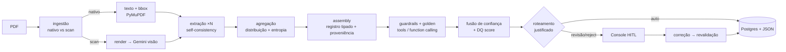

# Asset Servicing Agent — Extração Auditável de Eventos Corporativos

> Case Técnico AI Developer · BTG Pactual (Asset Servicing)

Agente **code-first** que recebe um lote de avisos de eventos corporativos
(proventos, JCP, bonificações, grupamentos — PDFs nativos e escaneados) e produz,
para cada documento, um **registro estruturado validado com tratamento de
incerteza**: o que foi extraído, **de onde** (proveniência), **quão confiável** é
cada campo, o resultado da **validação contra a base de referência**, e **o que
precisa de revisão humana e por quê** — tudo auditável sem reabrir o documento.

A arquitetura reaproveita, num domínio financeiro, a mesma espinha mental de uma
PoC que construí para migração de COBOL: **classificação semântica com
distribuição probabilística + guardrails determinísticos + human-in-the-loop +
rastreabilidade auditável end-to-end**.

---

## TL;DR — como rodar

```bash
# Jeito mais fácil — um comando faz tudo (detecta Gemini/stub e Postgres/SQLite):
./run.sh                 # setup + banco + lote + API (:8000) + console (:5173)
```

O `run.sh` detecta automaticamente o provider (**Gemini** se houver
`GOOGLE_API_KEY` no `.env`, senão **stub** offline) e o banco (**Postgres** via
Docker se disponível, senão **SQLite** local). Subcomandos: `setup`, `batch`,
`api`, `web`, `test`, `stop`.

Ou, **tudo em containers** (Postgres + API + console CAA):

```bash
docker compose -f infra/docker-compose.yml up --build   # console :5173 · API :8000
# Default offline (stub). Para Gemini: GOOGLE_API_KEY=xxx docker compose ... up
```

Ou passo a passo:

```bash
# 1) Backend (offline, sem API key: usa um extrator-stub determinístico)
cd backend && uv sync --extra dev
uv run asset-agent run            # gera outputs/ (JSONs + relatório de exceções)
uv run pytest -q                  # 34 testes

# 2) Com Gemini (free tier) — extração real por LLM + visão no escaneado
echo "GOOGLE_API_KEY=xxx" > ../.env
uv run asset-agent run --provider gemini

# 3) Produto CAA — Corporate Actions Agent (console human-in-the-loop)
make db-up                        # Postgres (ou DATABASE_URL=sqlite:///... sem Docker)
make api                          # FastAPI em :8000  (Swagger em /docs)
make web                          # CAA em :5173
#  → crie um projeto, suba PDFs (ou "carregar amostras"), clique "Realizar análise",
#    revise/aprove documento a documento e gere a documentação auditável.
```

Sem `GOOGLE_API_KEY`, todo o pipeline roda **100% offline** com um extrator
heurístico determinístico — o que torna os outputs e os testes **reproduzíveis
sem gastar quota**. Com a key, o mesmo pipeline usa **Gemini** (texto + visão).

---

## 1. Arquitetura — 4 pilares (origem: PoC COBOL)

| Pilar | Implementação aqui |
|---|---|
| **Classificação semântica probabilística** | Tipo de evento por **self-consistency** (N amostras → distribuição de votos + entropia → confiança). Confiança por campo ternária `{p_correct, p_uncertain, p_error}` ≈ `P(Chave)/P(Valor)/P(Incerto)`. |
| **Guardrails determinísticos** | ISIN/CNPJ, ticker↔classe, ordem de datas, JCP bruto/líquido (IRRF **data-driven**), groundedness (anti-alucinação), substância vs. tipo (armadilha dividendo↔JCP). Funções puras, também expostas como **LangChain tools** (function calling). |
| **Human-in-the-loop** | Console React (PDF + campos + confiança + aprovar/corrigir) → correção dispara **revalidação** determinística → trilha de auditoria *append-only*. |
| **Rastreabilidade auditável** | Proveniência por campo (quote + página + **bbox**), *run manifest* (modelo, prompt hash, N, doc hash), log de auditoria imutável, e um *data contract* versionado por documento. |



O núcleo é um **grafo LangGraph** (`extract → classify_and_assemble → validate →
score → route → finalize`); os nós compartilham a lógica com um runner direto
(testável). Ver [backend/app/agent/graph.py](backend/app/agent/graph.py).

## 2. O que sai (data contract)

Um JSON por documento ([outputs/json/](outputs/json/)) + um **relatório de
exceções** curto ([outputs/exceptions_report.md](outputs/exceptions_report.md)) +
um **run summary** (observabilidade). Cada registro contém:

- `document` — classe (nativo/scan), método de extração, modelo, **prompt_hash**, **doc_hash**, run_id.
- `record` — campos tipados (emissor, ISIN, ticker, CNPJ, tipo, datas, valores, IRRF, moeda).
- `event_type` — **distribuição** de tipo + entropia + confiança.
- `fields[]` — por campo: valor, `confidence{p_correct,p_uncertain,p_error}`, `evidence{quote,page,bbox}`, `grounded`, `rationale`.
- `validation` — `golden_match` (entity resolution explicável), `coherence_checks[]` (todos os guardrails), `dq_score` (componentes transparentes).
- `routing` — `decision` + **reasons** + **required_human_actions**.
- `audit` — sampling (N, temperatura), **tool_calls**, versões.

Schema completo em [backend/app/domain/schemas.py](backend/app/domain/schemas.py).

## 3. Modelo de confiança (interpretável = auditável)

Confiança por campo funde, com **pesos documentados** (não caixa-preta):

- `s` = concordância entre as N amostras (self-consistency);
- `r` = auto-confiança do modelo;
- `v` = **groundedness** (o valor está ancorado na fonte?);
- `g` = sinal de guardrail do campo.

`p_correct = 0.35·s + 0.20·r + 0.30·v + 0.15·g`; a massa restante é dividida entre
*uncertain* (dirigido por baixa concordância) e *error* (dirigido por baixa
ancoragem), de modo que os três números **explicam por que** um valor é frágil.
Tipo de evento: `P(tipo)=votos/N`, `entropia normalizada H`, `confiança=1−H`.
Ver [confidence.py](backend/app/agent/confidence.py) e
[selfconsistency.py](backend/app/agent/selfconsistency.py).

### Premissas documentadas (limiares — em [settings.py](backend/app/config/settings.py))

| Premissa | Valor | Significado |
|---|---|---|
| `field_review_threshold` | 0.70 | abaixo disso, o campo é "baixa confiança" → revisão |
| `type_entropy_review_threshold` | 0.35 | entropia de tipo acima disso → incerteza de classificação |
| `dq_review_threshold` | 0.75 | DQ do documento abaixo disso → revisão |
| `groundedness_min_score` | 0.60 | score mínimo de ancoragem para um valor ser "grounded" |
| `jcp_net_tolerance` | 2% | tolerância na conferência líquido ≈ bruto×(1−IRRF) |

## 4. Modelagem de domínio (B3/CVM) — onde mora o critério

> Construído a partir de experiência real consumindo dados da B3.

- **Tipo muda o tratamento tributário**, então classificar certo importa:
  - **Dividendo** vs **JCP** (juros sobre capital próprio): JCP tem **IRRF** retido e reporta bruto/líquido.
  - **Bonificação** (ações novas, proporção) vs **Grupamento/Desdobramento** (muda quantidade, não confundir).
- **IRRF é data-driven, não 15% fixo.** O lote de 2026 usa **17,5%**. O guardrail confere `líquido ≈ bruto × (1 − alíquota)` usando a alíquota extraída do aviso e, quando o provider não a extrai, **infere a retenção implícita** (`1 − líquido/bruto`) e valida que é plausível para JCP — robusto a variações de extração. Ver [coherence.py](backend/app/validation/coherence.py).
- **Armadilha dividendo↔JCP (doc 03):** um aviso intitulado "Dividendos" cuja substância é *remuneração sobre o capital próprio limitada à TJLP, com IRRF e valor líquido* é, por substância, **JCP**. Um guardrail de coerência detecta "dividendo com retenção (líquido < bruto)" e roteia para revisão.
- **Dígitos verificadores de ISIN/CNPJ são advisórios.** Calibrando contra a base, apenas 2/12 ISIN e 1/12 CNPJ passam o check digit (identificadores sintéticos). Logo, a **base de referência é o oráculo de identidade**; o checksum é informativo. `ticker↔classe` (sufixo 3=ON/4=PN/11=Unit), porém, é 12/12 confiável e tratado como autoritativo. *(Em produção, com identificadores reais, um checksum inválido escalaria.)*
- **Ticker + ISIN + CNPJ + emissor** são resolvidos contra `golden_records.csv` com **entity resolution explicável** (por que casou / por que divergiu), incluindo fuzzy match de emissor. Ver [golden_match.py](backend/app/validation/golden_match.py).

## 5. Política de roteamento (determinística e justificada)

- **REJECT** — identidade não confiável (conflito de identificadores; ou sem ISIN e fora da base, em doc nativo).
- **HUMAN_REVIEW** — emissor desconhecido · campo obrigatório ausente · tipo ambíguo/entropia alta · falha de coerência crítica (datas, JCP, substância) · campo de baixa confiança · valor sem âncora · DQ baixo · documento escaneado.
- **AUTO_APPROVE** — todos os guardrails passam, identidade confirmada, campos confiáveis e DQ alto.

### Resultado sobre o lote (offline stub — reproduzível com `make run`)

| Documento | Tipo | Decisão | Gatilho |
|---|---|---|---|
| 01 energética vale tietê | DIVIDENDO | **AUTO** | limpo, golden EXACT |
| 02 banco meridional | JCP | **AUTO** | bruto/líquido coerentes (IRRF 17,5%) |
| 03 siderúrgica paranaense | DIVIDENDO→**JCP?** | **REVIEW** | substância de JCP sob título de dividendo |
| 04 rede varejo (sem data) | JCP | **REVIEW** | `data_pagamento` ausente ("A definir") |
| 05 aurora saneamento | DIVIDENDO | **REVIEW** | incoerência de datas (pagamento antes da ex) |
| 06 petroquímica litoral | GRUPAMENTO | **AUTO** | proporção 10:1, limpo |
| 07 telecom norte (SCAN) | — | **REVIEW** | escaneado → visão/leitura humana |
| 08 construtora horizonte | BONIFICAÇÃO | **REVIEW** | emissor fora da base de referência |

### Execução real com Gemini (run ao vivo)

O lote também foi processado ao vivo com **`gemini-2.5-flash`** (texto + **visão**
no doc 07 escaneado). Resultados em [outputs/gemini_run/](outputs/gemini_run/):

- **Doc 03 (a "armadilha")** → o LLM classificou corretamente como **JCP** pela
  substância (o stub heurístico dizia DIVIDENDO) → auto-aprovado coerente. Ótima
  demonstração do valor do LLM sobre a heurística.
- **Doc 07 (escaneado)** → a **visão** leu o aviso (JCP) → revisão (scan sempre confere).
- **4 auto / 3 revisão** (de 7). O doc 08 não completou por **limite do free tier**
  (cota diária esgotada após ~21 chamadas) — capturado pela resiliência do batch
  (uma falha por documento não derruba o lote).

O `outputs/` canônico é o run **offline (stub)**, completo (8 docs) e 100%
reproduzível (`./run.sh` sem key). O run do Gemini é reproduzível offline via
`asset-agent run --provider gemini --replay --n 3` (cache commitado em `.cache/`).

## 6. Produto: CAA — Corporate Actions Agent (human-in-the-loop)

React + Vite + TS ([frontend/](frontend/)). O fluxo é orientado a **projetos**:

1. **Projetos** — criar / **renomear** / **excluir**; cada projeto tem estado
   (`Rascunho → Em análise → Em revisão → Concluído`) e progresso (`X/N decididos`).
2. **Arquivos** — upload de 1+ PDFs (arrastar/soltar ou "carregar amostras"),
   remover arquivos e **"Realizar análise"** (roda o pipeline nos arquivos do projeto).
3. **Análise** — selecione um documento e veja, lado a lado, a **imagem da página**
   e a **análise**: campos editáveis com confiança *color-coded*, proveniência
   (quote/bbox), distribuição de tipo, **golden match explicável**, guardrails e
   **trilha de auditoria**. Aprovar / corrigir / rejeitar por documento.
4. **Documentação** — relatório auditável (resumo, decisão por doc, **o que foi
   corrigido e por quem**, registros finais), exportável em JSON.

Corrigir um campo dispara **revalidação** determinística (ex.: corrigir a data de
pagamento do doc 05 leva `HUMAN_REVIEW → AUTO_APPROVE`) e grava no log *append-only*.

**Leitura de escaneados (OCR/visão):** documentos sem camada de texto (doc 07) são
renderizados em imagem e lidos pelo **Gemini Vision** — um VLM que faz o
reconhecimento do texto **e** a extração estruturada em uma única etapa. Não há
motor de OCR clássico (Tesseract) por decisão de escopo; a UI sinaliza isso
explicitamente no documento escaneado (e, offline com o stub, indica que o OCR não
foi executado → revisão humana).

## 7. Estrutura do repositório

```
backend/app/
  domain/        # enums, schemas (data contract), parsing BR, golden loader
  extraction/    # PyMuPDF (nativo/scan, bbox, render p/ visão), proveniência (fuzzy → bbox)
  llm/           # boundary: base, cache (replay), gemini (visão), stub, prompts, factory
  agent/         # self-consistency, confiança, assembly, routing, LangGraph
  guardrails/    # runner + tools (function calling)
  validation/    # identificadores, coerência, golden match, groundedness, DQ
  persistence/   # Postgres (SQLAlchemy): projetos + documentos + audit append-only + revalidação HITL
  api/           # FastAPI: projetos, upload, analyze, review, audit, pdf/page.png, report
  output/        # writer (JSONs + relatório + run summary) ; cli.py
backend/tests/   # testes (unit + integração sobre o lote + API + lifecycle de projeto)
frontend/src/    # CAA: App (router por abas), views (projetos/upload/documentação),
                 #      ReviewConsole (análise), components, api, types
infra/           # docker-compose (Postgres + API + web) ; Makefile ; run.sh
uploads/         # PDFs enviados, por projeto (gitignored)
outputs/         # ENTREGÁVEL: JSONs + exceptions_report.{md,json} + run_summary.json ; outputs/gemini_run/
```

## 8. Escala & Produção (design — **não implementado**, escopo de fim de semana)

A estrutura já é orientada a orquestração, então escalar de 8 docs para milhares/dia
é incremental (e foi pensado com a experiência prévia em **Airflow + Spark**):

- **1 documento = 1 task**; **Airflow** com *dynamic task mapping* + retries/backfill.
- **Spark** paraleliza o pré-processamento (render de PDF + extração de texto é *embarrassingly parallel*).
- **Guardrails determinísticos escalam trivialmente** (CPU-bound, sem estado); as **chamadas LLM** ficam atrás de uma fila com rate-limit + backoff + **cache**.
- **Idempotência por `doc_hash`** torna *retry/backfill* seguros; Postgres como *state store*.
- Separação clara entre o **tier determinístico (barato)** e o **tier LLM (caro, limitado por quota)**.

## 9. Trade-offs — o que decidi **não** fazer (e por quê)

- **Sem auth/RBAC/multi-tenant** — identidade de operador *mockada* só para a auditoria; fora do escopo do case.
- **Sem vector DB / RAG** — a base de referência é minúscula; match exato + fuzzy é mais simples, rápido e auditável.
- **Sem fine-tuning** — *prompt + structured output + self-consistency* bastam e são defensáveis.
- **HITL por persist-and-revalidate**, não `interrupt()` + checkpointer LangGraph — mais simples e depurável ao vivo; o grafo e o checkpointer Postgres ficam prontos para a versão durável (documentado, não foi o caminho default).
- **Sem overlay pixel-perfect de bbox no PDF** — o PDF é exibido em `iframe` e a proveniência (quote + página + bbox) aparece no card do campo; o overlay em canvas (pdf.js) fica como evolução.
- **OCR pragmático** — um único escaneado tratado por visão do Gemini; sem robustez OCR genérica para qualquer scan.
- **Escala (Airflow/Spark) é documentada, não implementada** — tempo de fim de semana priorizou profundidade do núcleo + console.
- **Dígitos verificadores advisórios** — decisão calibrada nos dados (ver §4); em produção, escalaria.

## 10. Glossário (nomeando as técnicas)

**Self-consistency** (amostragem + voto majoritário) · **Groundedness/faithfulness**
(anti-alucinação) · **Calibration** (confiança reflete acerto) · **Entity
resolution / record linkage** (casar com a base) · **Data contract** (schema
estável p/ downstream) · **Idempotency / backfill** (`doc_hash` → re-run seguro) ·
**Human-in-the-loop** (incerteza → operador, com justificativa).

## 11. Execução — referência

| Comando | O quê |
|---|---|
| `make install` | instala o backend (uv) |
| `make run` | roda o lote → `outputs/` (offline se não houver key) |
| `make replay` | reproduz do cache, sem chamadas ao LLM |
| `make test` | 29 testes |
| `make api` / `make web` | API (:8000) e console (:5173) |
| `make db-up` | sobe o Postgres (docker) |

Provider: `auto` (Gemini se `GOOGLE_API_KEY`, senão `stub`). Modelo: `gemini-2.5-flash`
(o free tier dos modelos 2.0/1.5 estava indisponível neste projeto — limite 0 / 404).
Persistência: `DATABASE_URL` (Postgres por padrão; aceita `sqlite:///...` para rodar
sem Docker).
