<p align="center">
  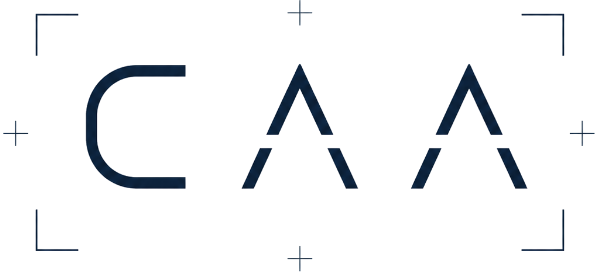
</p>

<h1 align="center">CAA — Corporate Actions Agent</h1>

<p align="center">
  <strong>Extração auditável de eventos corporativos com tratamento de incerteza e human-in-the-loop.</strong><br/>
  <sub>Proventos · JCP · Bonificações · Grupamentos — PDFs nativos e escaneados (B3/CVM)</sub>
</p>

---

O **CAA (Corporate Actions Agent)** é um agente **code-first** que recebe um lote de
avisos de eventos corporativos e produz, para cada documento, um **registro
estruturado validado com tratamento de incerteza**: o que foi extraído, **de onde**
(proveniência), **quão confiável** é cada campo, o resultado da **validação contra a
base de referência**, e **o que precisa de revisão humana e por quê** — tudo
auditável sem reabrir o documento.

A arquitetura aplica, num domínio financeiro (B3/CVM), uma espinha mental madura
(reaproveitada de uma PoC de migração de COBOL): **classificação semântica com
distribuição probabilística + guardrails determinísticos + human-in-the-loop +
rastreabilidade auditável end-to-end**.

## Entregáveis

- **Repositório com o código** + **instruções de execução** neste README (ver **TL;DR** logo abaixo).
- **README com as decisões de arquitetura**, incluindo explicitamente **o que decidi _não_ fazer e por quê** — ver **§9 (Trade-offs)**, detalhado.
- **`outputs/`** — o entregável de dados: um **JSON auditável por documento** + **relatório de exceções** + **run summary** (ver **§2 — Data contract**).
- **Console CAA** (human-in-the-loop) — produto React para revisar / corrigir / aprovar, com **exportação em PDF** (certificado + relatório) e **grafo de rastreabilidade**.
- **Telas da aplicação** — ver **§ Telas (screenshots)**.

---

## TL;DR — como rodar

```bash
# Jeito mais fácil — um comando faz tudo (detecta Gemini/stub e Postgres/SQLite):
./run.sh                 # setup + banco + lote + API (:8000) + console (:5173)
```

O `run.sh` detecta automaticamente o provider (**Gemini** se houver
`GOOGLE_API_KEY` no `.env`, senão **stub** offline) e o banco (**Postgres** via
Docker se disponível, senão **SQLite** local). Subcomandos: `setup`, `batch`,
`api`, `web`, `test`, `stop`.

Ou, **tudo em containers** (Postgres + API + console CAA):

```bash
docker compose -f infra/docker-compose.yml up --build   # console :5173 · API :8000
# Default offline (stub). Para Gemini: GOOGLE_API_KEY=xxx docker compose ... up
```

Ou passo a passo:

```bash
# 1) Backend (offline, sem API key: usa um extrator-stub determinístico)
cd backend && uv sync --extra dev
uv run asset-agent run            # gera outputs/ (JSONs + relatório de exceções)
uv run pytest -q                  # 49 testes

# 2) Com Gemini (free tier) — extração real por LLM + visão no escaneado
echo "GOOGLE_API_KEY=xxx" > ../.env
uv run asset-agent run --provider gemini

# 3) Produto CAA — Corporate Actions Agent (console human-in-the-loop)
make db-up                        # Postgres (ou DATABASE_URL=sqlite:///... sem Docker)
make api                          # FastAPI em :8000  (Swagger em /docs)
make web                          # CAA em :5173
#  → crie um projeto, suba PDFs (ou "carregar amostras"), clique "Realizar análise",
#    revise/aprove documento a documento e gere a documentação auditável.
```

O `outputs/` commitado é o run **real com Gemini** (texto + visão), reproduzível
offline via cache (`asset-agent run --provider gemini --replay`, sem gastar quota).
A aplicação **sempre prefere o Gemini** quando há `GOOGLE_API_KEY`, degradando
automaticamente para o extrator **stub** offline (determinístico, com **OCR
Tesseract** no escaneado) apenas se faltar a chave **ou** a quota/free tier esgotar
— o fallback é por documento, então um esgotamento de quota não derruba o lote.

---

## 1. Arquitetura — 4 pilares (origem: PoC COBOL)

| Pilar | Implementação aqui |
|---|---|
| **Classificação semântica probabilística** | Tipo de evento por **self-consistency** (N amostras → distribuição de votos + entropia → confiança). Confiança por campo ternária `{p_correct, p_uncertain, p_error}` ≈ `P(Chave)/P(Valor)/P(Incerto)`. |
| **Guardrails determinísticos** | ISIN/CNPJ, ticker↔classe, ordem de datas, JCP bruto/líquido (IRRF **data-driven**), groundedness (anti-alucinação), substância vs. tipo (armadilha dividendo↔JCP). Funções puras, também expostas como **LangChain tools** (function calling). |
| **Human-in-the-loop** | Console React (PDF + campos + confiança + aprovar/corrigir) → correção dispara **revalidação** determinística → trilha de auditoria *append-only*. |
| **Rastreabilidade auditável** | Proveniência por campo (quote + página + **bbox**), *run manifest* (modelo, prompt hash, N, doc hash), log de auditoria imutável, e um *data contract* versionado por documento. |

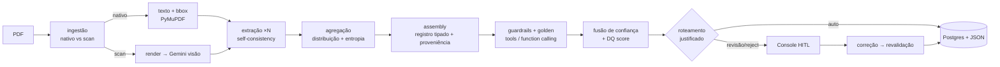

O núcleo é um **grafo LangGraph** (`extract → classify_and_assemble → validate →
score → route → finalize`); os nós compartilham a lógica com um runner direto
(testável). Ver [backend/app/agent/graph.py](backend/app/agent/graph.py).

## 2. O que sai (data contract)

Um JSON por documento ([outputs/json/](outputs/json/)) + um **relatório de
exceções** curto ([outputs/exceptions_report.md](outputs/exceptions_report.md)) +
um **run summary** (observabilidade). Cada registro contém:

- `document` — classe (nativo/scan), método de extração, modelo, **prompt_hash**, **doc_hash**, run_id.
- `record` — campos tipados (emissor, ISIN, ticker, CNPJ, tipo, datas, valores, IRRF, moeda).
- `event_type` — **distribuição** de tipo + entropia + confiança.
- `fields[]` — por campo: valor, `confidence{p_correct,p_uncertain,p_error}`, `evidence{quote,page,bbox}`, `grounded`, `rationale`.
- `validation` — `golden_match` (entity resolution explicável), `coherence_checks[]` (todos os guardrails), `dq_score` (componentes transparentes).
- `routing` — `decision` + **reasons** + **required_human_actions**.
- `audit` — sampling (N, temperatura), **tool_calls**, versões.

Schema completo em [backend/app/domain/schemas.py](backend/app/domain/schemas.py).

## 3. Modelo de confiança (interpretável = auditável)

Confiança por campo funde, com **pesos documentados** (não caixa-preta):

- `s` = concordância entre as N amostras (self-consistency);
- `r` = auto-confiança do modelo;
- `v` = **groundedness** (o valor está ancorado na fonte?);
- `g` = sinal de guardrail do campo.

`p_correct = 0.35·s + 0.20·r + 0.30·v + 0.15·g`; a massa restante é dividida entre
*uncertain* (dirigido por baixa concordância) e *error* (dirigido por baixa
ancoragem), de modo que os três números **explicam por que** um valor é frágil.
Tipo de evento: `P(tipo)=votos/N`, `entropia normalizada H`, `confiança=1−H`.
Ver [confidence.py](backend/app/agent/confidence.py) e
[selfconsistency.py](backend/app/agent/selfconsistency.py).

### Premissas documentadas (limiares — em [settings.py](backend/app/config/settings.py))

| Premissa | Valor | Significado |
|---|---|---|
| `field_review_threshold` | 0.70 | abaixo disso, o campo é "baixa confiança" → revisão |
| `type_entropy_review_threshold` | 0.35 | entropia de tipo acima disso → incerteza de classificação |
| `dq_review_threshold` | 0.75 | DQ do documento abaixo disso → revisão |
| `groundedness_min_score` | 0.60 | score mínimo de ancoragem para um valor ser "grounded" |
| `jcp_net_tolerance` | 2% | tolerância na conferência líquido ≈ bruto×(1−IRRF) |

## 4. Modelagem de domínio (B3/CVM) — onde mora o critério

> Construído a partir de experiência real consumindo dados da B3.

- **Tipo muda o tratamento tributário**, então classificar certo importa:
  - **Dividendo** vs **JCP** (juros sobre capital próprio): JCP tem **IRRF** retido e reporta bruto/líquido.
  - **Bonificação** (ações novas, proporção) vs **Grupamento/Desdobramento** (muda quantidade, não confundir).
- **IRRF é data-driven, não 15% fixo.** O lote de 2026 usa **17,5%**. O guardrail confere `líquido ≈ bruto × (1 − alíquota)` usando a alíquota extraída do aviso e, quando o provider não a extrai, **infere a retenção implícita** (`1 − líquido/bruto`) e valida que é plausível para JCP — robusto a variações de extração. Ver [coherence.py](backend/app/validation/coherence.py).
- **Armadilha dividendo↔JCP (doc 03):** um aviso intitulado "Dividendos" cuja substância é *remuneração sobre o capital próprio limitada à TJLP, com IRRF e valor líquido* é, por substância, **JCP**. Um guardrail de coerência detecta "dividendo com retenção (líquido < bruto)" e roteia para revisão.
- **Dígitos verificadores de ISIN/CNPJ são advisórios.** Calibrando contra a base, apenas 2/12 ISIN e 1/12 CNPJ passam o check digit (identificadores sintéticos). Logo, a **base de referência é o oráculo de identidade**; o checksum é informativo. `ticker↔classe` (sufixo 3=ON/4=PN/11=Unit), porém, é 12/12 confiável e tratado como autoritativo. *(Em produção, com identificadores reais, um checksum inválido escalaria.)*
- **Ticker + ISIN + CNPJ + emissor** são resolvidos contra `golden_records.csv` com **entity resolution explicável** (por que casou / por que divergiu), incluindo fuzzy match de emissor. Ver [golden_match.py](backend/app/validation/golden_match.py).

## 5. Política de roteamento (determinística e justificada)

- **REJECT** — identidade não confiável (conflito de identificadores; ou sem ISIN e fora da base, em doc nativo).
- **HUMAN_REVIEW** — emissor desconhecido · campo obrigatório ausente · tipo ambíguo/entropia alta · falha de coerência crítica (datas, JCP, substância) · campo de baixa confiança · valor sem âncora · DQ baixo · documento escaneado.
- **AUTO_APPROVE** — todos os guardrails passam, identidade confirmada, campos confiáveis e DQ alto.

### Resultado sobre o lote (run **Gemini** — canônico em `outputs/`)

Processado com **`gemini-2.5-flash`** (texto + **visão** no doc 07 escaneado):
**4 auto-aprovados / 4 revisão**, confiança média **97%**.

| Documento | Tipo | Decisão | Gatilho |
|---|---|---|---|
| 01 energética vale tietê | DIVIDENDO | **AUTO** | limpo, golden EXACT |
| 02 banco meridional | JCP | **AUTO** | bruto/líquido coerentes (IRRF 17,5%) |
| 03 siderúrgica paranaense | **JCP** | **AUTO** | LLM classifica pela substância (título "Dividendos") |
| 04 rede varejo (sem data) | JCP | **REVIEW** | `data_pagamento` ausente ("A definir") |
| 05 aurora saneamento | DIVIDENDO | **REVIEW** | incoerência de datas (pagamento antes da ex) |
| 06 petroquímica litoral | GRUPAMENTO | **AUTO** | proporção 10:1, limpo |
| 07 telecom norte (SCAN) | JCP | **REVIEW** | escaneado lido por **Gemini Vision** → confere |
| 08 construtora horizonte | BONIFICAÇÃO | **REVIEW** | emissor fora da base de referência |

**Destaques do LLM:** doc 03 (a "armadilha") — classificado corretamente como
**JCP** pela substância (o stub heurístico dizia DIVIDENDO), auto-aprovado coerente;
doc 07 (escaneado) — a **visão** lê o aviso e extrai os 13 campos (todas as datas
corretas).

### Run offline (stub) — alternativa 100% reproduzível sem key

Sem `GOOGLE_API_KEY`, o mesmo lote roda com o extrator heurístico determinístico
(escaneado via **OCR Tesseract**): **3 auto / 5 revisão** — a única diferença é o
doc 03, que a heurística mantém em revisão (não infere JCP pela substância como o
LLM). É o caminho usado pelos testes e por `./run.sh` sem key.

O `outputs/` commitado é o run **Gemini**, reproduzível offline via
`asset-agent run --provider gemini --replay` (cache commitado em `.cache/`).

## 6. Produto: CAA — Corporate Actions Agent (human-in-the-loop)

React + Vite + TS ([frontend/](frontend/)). O fluxo é orientado a **projetos**:

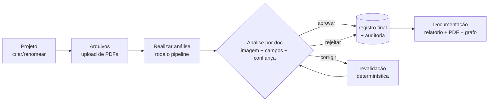

1. **Projetos** — criar / **renomear** / **excluir**; cada projeto tem estado
   (`Rascunho → Em análise → Em revisão → Concluído`) e progresso (`X/N decididos`).
2. **Arquivos** — upload de 1+ PDFs (arrastar/soltar ou "carregar amostras"),
   remover arquivos e **"Realizar análise"** (roda o pipeline nos arquivos do projeto).
3. **Análise** — selecione um documento e veja, lado a lado, a **imagem da página**
   e a **análise**: campos editáveis com confiança *color-coded*, proveniência
   (quote/bbox), distribuição de tipo, **golden match explicável**, guardrails e
   **trilha de auditoria**. Aprovar / corrigir / rejeitar por documento.
4. **Documentação** — relatório auditável (resumo, decisão por doc, **o que foi
   corrigido e por quem**, registros finais), exportável em **JSON** e **PDF com a
   identidade visual da CAA** (certificado por documento aprovado + relatório
   consolidado do projeto, via WeasyPrint), além de um **grafo de rastreabilidade**
   que mostra como os documentos se relacionam (mesmo emissor, mesmo tipo de
   evento, possíveis duplicatas) com evidência campo a campo.

Corrigir um campo dispara **revalidação** determinística (ex.: corrigir a data de
pagamento do doc 05 leva `HUMAN_REVIEW → AUTO_APPROVE`) e grava no log *append-only*.

**Leitura de escaneados — visão e OCR se complementam:** num scan (doc 07) duas
fontes *independentes* leem a mesma página e se complementam:
- **Gemini Vision** lê a imagem e devolve os valores estruturados + *quote* (boa
  acurácia, entende layout/tabela; resolve a armadilha de *dotted leaders*);
- **Tesseract** (`por+eng`) transcreve a imagem em texto **com bounding boxes**.

O sistema funde os dois: (1) **ancora** cada valor da visão na palavra/bbox do OCR
(proveniência `VISION+OCR`, com caixa na página — que a visão sozinha não dá);
(2) **verifica** o valor da visão contra o texto do OCR (groundedness/anti-
alucinação); e (3) roda o extrator determinístico sobre o texto do OCR como um
**voto independente** — um guardrail `vision_ocr_crosscheck` escala divergências
visão↔OCR em campos críticos para revisão. Offline (sem Gemini), o Tesseract
sozinho sustenta a extração. O método efetivo (`gemini_vision` ou `tesseract_ocr`)
é registrado por documento, e o scan é sempre roteado para conferência humana.

## Telas (screenshots)

> Console CAA (human-in-the-loop) processando o lote "Eventos B3 — Junho/2026".

### 1 · Projetos
Lista de projetos com estado e progresso (`X/N decididos`); operador identificado para a auditoria.
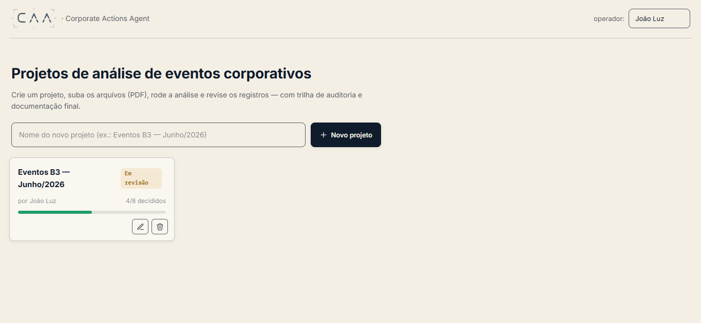

### 2 · Arquivos
Upload de PDFs (arrastar/soltar ou carregar amostras) e disparo da análise.
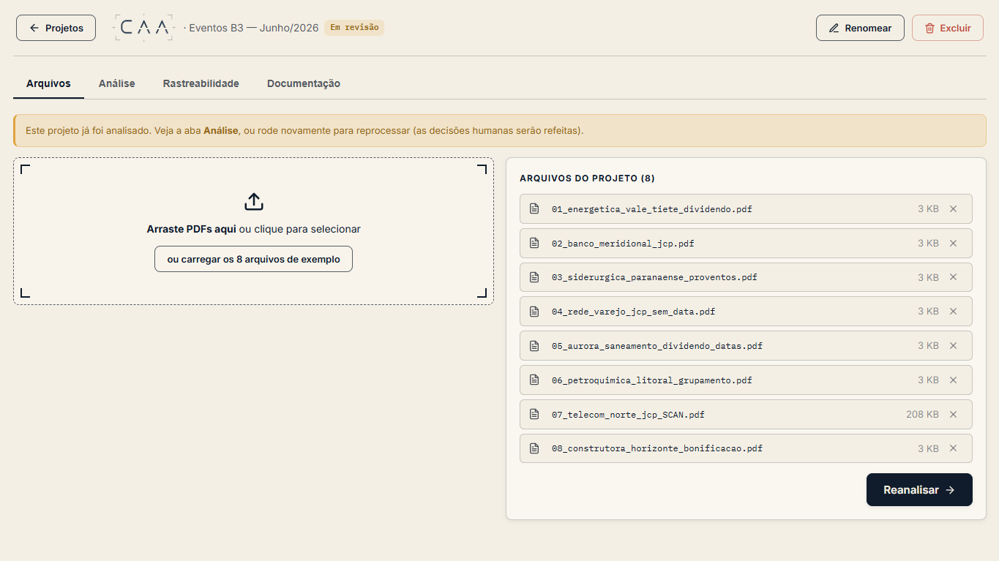

### 3 · Análise — visão geral do lote
Auto-aprovados vs. revisão, confiança média, **mix de tipos** e **motivos de exceção** (observabilidade), com a fila de documentos.
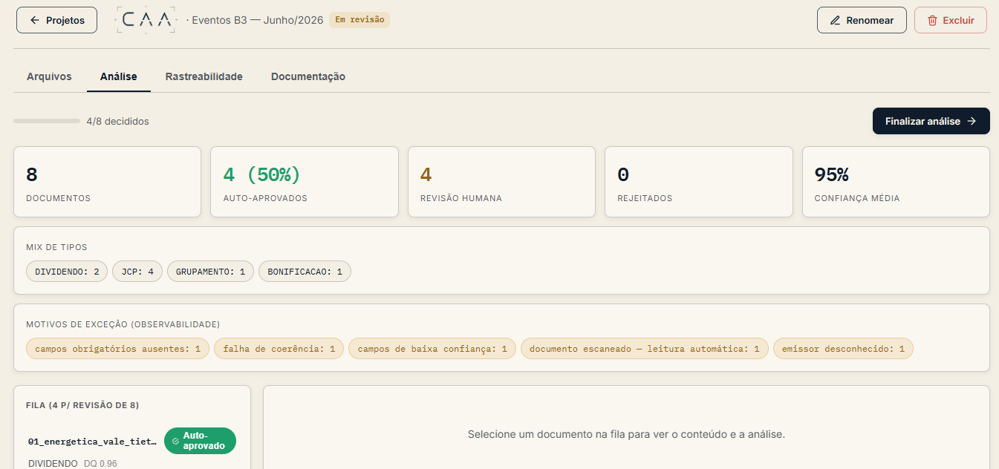

### 4 · Análise — documento (imagem + campos + confiança + proveniência)
Imagem da página ao lado dos campos extraídos — cada um com confiança *color-coded*, **fonte da evidência**, *quote* e bbox.
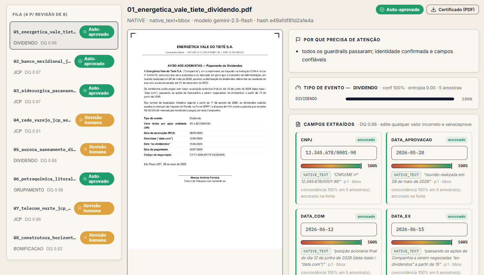

### 5 · Validação — golden match, guardrails e auditoria
Entity resolution explicável contra a base, guardrails determinísticos (com checksums advisórios) e a **trilha de auditoria** *append-only*.
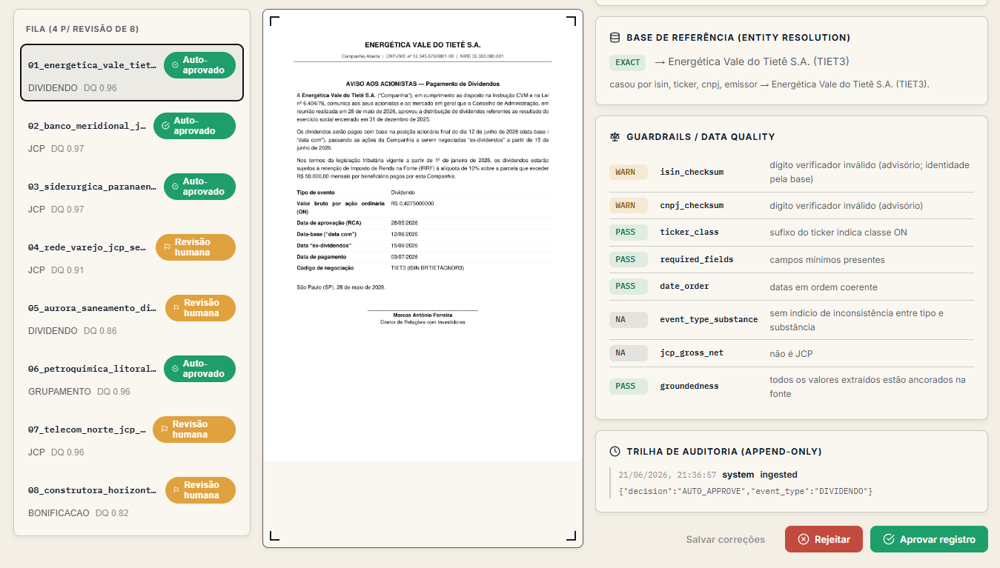

### 6 · Rastreabilidade — grafo
Como os documentos se relacionam (mesmo emissor, mesmo tipo, mesmo ativo, possível duplicidade) com evidência campo a campo.
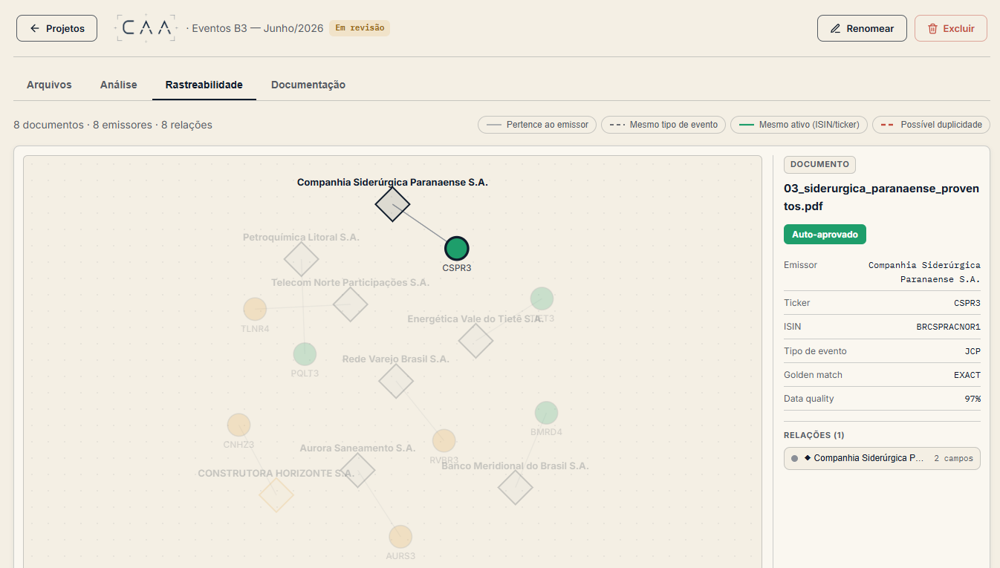

### 7 · Documentação
Relatório auditável do projeto (resumo, decisão por doc, correções, registros finais), exportável em JSON/PDF.
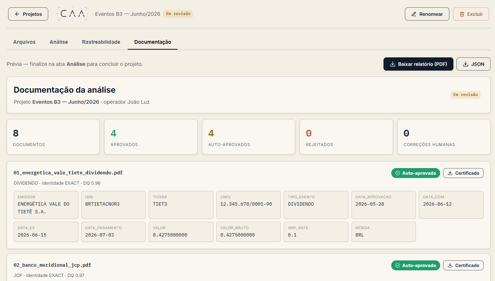

### 8 · Certificado em PDF (identidade visual CAA)
Certificado por documento aprovado: identidade, entity resolution, classificação/DQ e procedência.
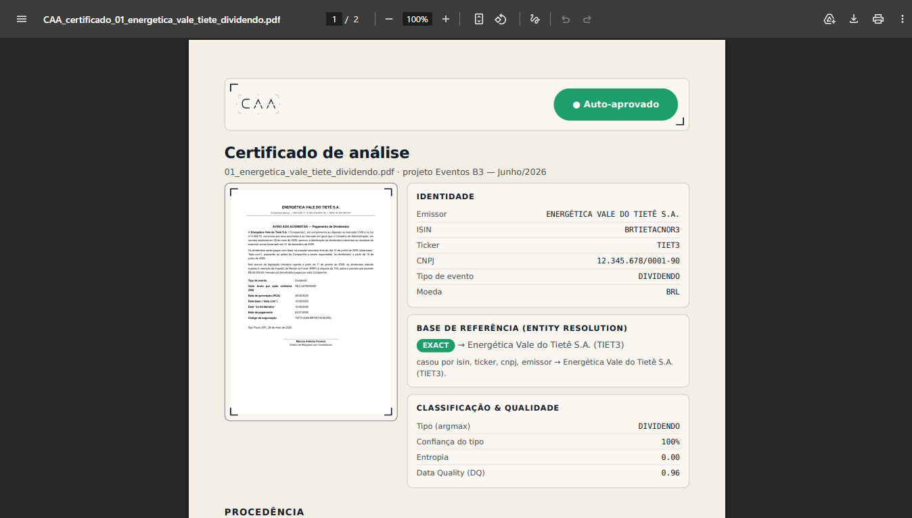

## 7. Estrutura do repositório

```
backend/app/
  domain/        # enums, schemas (data contract), parsing BR, golden loader
  extraction/    # PyMuPDF (nativo/scan, bbox), OCR Tesseract (escaneado), proveniência (fuzzy → bbox)
  llm/           # boundary: base, cache (replay), gemini (visão), stub, prompts, factory
  agent/         # self-consistency, confiança, assembly, crossmodal (visão×OCR), routing, LangGraph
  guardrails/    # runner + tools (function calling)
  validation/    # identificadores, coerência, golden match, groundedness, DQ
  persistence/   # Postgres (SQLAlchemy): projetos + documentos + audit append-only + revalidação HITL
  api/           # FastAPI: projetos, upload, analyze, review, audit, graph, page.png, PDFs (certificado/relatório)
  output/        # writer (JSONs + relatório + run summary), PDF CAA (certificado/relatório) ; cli.py
backend/tests/   # testes (unit + integração sobre o lote + API + lifecycle de projeto)
frontend/src/    # CAA: App (router por abas), views (projetos/upload/documentação),
                 #      ReviewConsole (análise), GraphPanel (rastreabilidade), components, icons, api, types
infra/           # docker-compose (Postgres + API + web) ; Makefile ; run.sh
uploads/         # PDFs enviados, por projeto (gitignored)
outputs/         # ENTREGÁVEL: JSONs + exceptions_report.{md,json} + run_summary.json
```

## 8. Escala & Produção (design — **não implementado**, escopo de fim de semana)

A estrutura já é orientada a orquestração, então escalar de 8 docs para milhares/dia
é incremental (e foi pensado com a experiência prévia em **Airflow + Spark**):

- **1 documento = 1 task**; **Airflow** com *dynamic task mapping* + retries/backfill.
- **Spark** paraleliza o pré-processamento (render de PDF + extração de texto é *embarrassingly parallel*).
- **Guardrails determinísticos escalam trivialmente** (CPU-bound, sem estado); as **chamadas LLM** ficam atrás de uma fila com rate-limit + backoff + **cache**.
- **Idempotência por `doc_hash`** torna *retry/backfill* seguros; Postgres como *state store*.
- Separação clara entre o **tier determinístico (barato)** e o **tier LLM (caro, limitado por quota)**.

## 9. Trade-offs — o que decidi **não** fazer (e por quê)

> **Profundidade > amplitude.** Num escopo de fim de semana, escolhi **aprofundar o
> núcleo que define a qualidade de um agente de Asset Servicing** — confiança
> calibrada, proveniência, guardrails determinísticos e human-in-the-loop — em vez de
> espalhar features rasas. Cada "não" abaixo é uma **decisão de engenharia
> consciente**, com o caminho de produção mapeado.

**1. HITL por _persist-and-revalidate_, não `interrupt()` + checkpointer LangGraph.**
Quando o operador corrige um campo, eu **persisto a correção e re-rodo os guardrails
determinísticos** (revalidação), em vez de suspender o grafo num checkpoint durável.
_Por quê:_ é mais simples, depurável ao vivo e transparente — a correção do doc 05
(data de pagamento) leva `HUMAN_REVIEW → AUTO_APPROVE` na hora, e tudo fica no log
*append-only*. _Produção:_ o grafo LangGraph e o checkpointer Postgres já estão
estruturados; migrar para `interrupt()` durável é incremental quando houver fila/SLA
de revisão.

**2. Sem autenticação / RBAC / multi-tenant.**
A identidade do operador é *mockada* só para carimbar a auditoria. _Por quê:_ auth é
um problema resolvido (OIDC/SSO) e **ortogonal** ao que o case avalia (qualidade da
extração e do juízo). _Produção:_ entra atrás de um gateway com SSO + RBAC por papel
(operador vs. auditor) — o log *append-only* já está pronto para receber a identidade
real.

**3. Sem vector DB / RAG.**
A base de referência (`golden_records.csv`) é minúscula e **estruturada**. _Por quê:_
match exato + *fuzzy* + *entity resolution* explicável é mais simples, mais rápido e
**mais auditável** que recuperar por similaridade vetorial (que traria respostas
"prováveis" difíceis de justificar a um auditor). RAG só se justifica com base de
conhecimento grande e textual — não é o caso.

**4. Sem fine-tuning.**
*Prompt design + structured output + self-consistency* já entregam classificação
calibrada e defensável. _Por quê:_ fine-tuning exigiria dados rotulados,
versionamento de modelo e re-treino — investimento que só compensa com volume e
*drift* comprovados, e que adiciona opacidade num domínio onde preciso **explicar**
cada decisão.

**5. OCR híbrido pragmático, não um motor OCR genérico.**
O escaneado é **lido pela visão do Gemini e ancorado/verificado pelo Tesseract**
(`por+eng`, bbox + voto cruzado). _Por quê:_ é afinado para o aviso do lote, **não**
uma pipeline OCR robusta a qualquer layout/rotação/caligrafia — generalizar exigiria
deskew, modelos de layout e tabelas. _Produção:_ a arquitetura isola isso atrás de
`extraction/`, então trocar/robustecer o motor é uma mudança local.

**6. Sem overlay _pixel-perfect_ de bbox sobre o PDF.**
A proveniência (quote + página + **bbox**) aparece no card do campo e a imagem da
página é exibida ao lado; não desenho o retângulo exato sobre a página. _Por quê:_
o dado do bbox **já existe** no contrato — o overlay em canvas (pdf.js) é só camada de
UI, deixada como evolução de baixo risco.

**7. Escala (Airflow + Spark) é desenho, não código.**
A estrutura **já é orientada a orquestração** (1 doc = 1 task, idempotência por
`doc_hash`, tiers determinístico/LLM separados — ver §8), mas o DAG real não foi
implementado. _Por quê:_ priorizei **provar o núcleo + o console ponta a ponta**.
Escalar a partir daqui é incremental, não uma reescrita.

**8. Dígitos verificadores (ISIN/CNPJ) tratados como _advisórios_.**
Decisão **calibrada nos dados**: na base sintética só 2/12 ISIN e 1/12 CNPJ passam o
*check digit*. _Por quê:_ logo a **base de referência é o oráculo de identidade** e o
checksum é informativo (já `ticker↔classe`, 12/12 confiável, é autoritativo).
_Produção:_ com identificadores reais, um checksum inválido **escalaria** — é um
parâmetro, não uma crença.

**9. Self-consistency com N pequeno (2–5), não dezenas de amostras.**
Mais amostras calibram melhor a confiança, mas custam quota linearmente. _Por quê:_
N=5 (default) equilibra sinal e custo no *free tier*; o número é um *setting*
documentado em [settings.py](backend/app/config/settings.py), não mágico.

**10. O _stub_ determinístico é cidadão de primeira classe (de propósito).**
Manter um extrator heurístico offline não é "preguiça": é o que torna **testes e
outputs reproduzíveis sem gastar quota** e dá um **fallback** real quando o Gemini
fica sem cota (degradação por documento, sem derrubar o lote). Provider e reprodução
ficam **desacoplados** do núcleo — uma propriedade de arquitetura, não um atalho.

## 10. Glossário (nomeando as técnicas)

**Self-consistency** (amostragem + voto majoritário) · **Groundedness/faithfulness**
(anti-alucinação) · **Calibration** (confiança reflete acerto) · **Entity
resolution / record linkage** (casar com a base) · **Data contract** (schema
estável p/ downstream) · **Idempotency / backfill** (`doc_hash` → re-run seguro) ·
**Human-in-the-loop** (incerteza → operador, com justificativa).

## 11. Execução — referência

| Comando | O quê |
|---|---|
| `make install` | instala o backend (uv) |
| `make run` | roda o lote → `outputs/` (offline se não houver key) |
| `make replay` | reproduz do cache, sem chamadas ao LLM |
| `make test` | 49 testes |
| `make api` / `make web` | API (:8000) e console (:5173) |
| `make db-up` | sobe o Postgres (docker) |

Provider: `auto` (Gemini se `GOOGLE_API_KEY`, senão `stub`); **sempre prefere o
Gemini** e cai no `stub` offline só quando falta a chave ou a quota/free tier
esgota (fallback por documento). Modelo: `gemini-2.5-flash`
(o free tier dos modelos 2.0/1.5 estava indisponível neste projeto — limite 0 / 404).
Persistência: `DATABASE_URL` (Postgres por padrão; aceita `sqlite:///...` para rodar
sem Docker).
